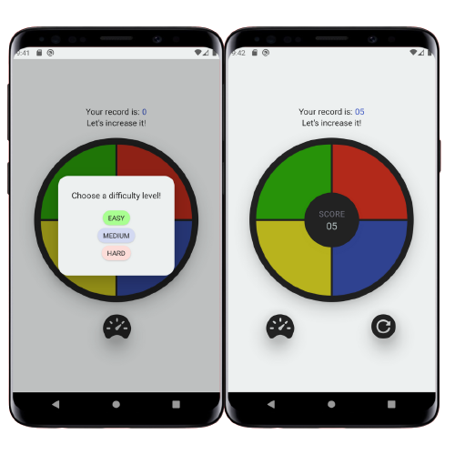

<h1 align="center">
   
</h1>

### Como executar o GeniusGame

**1.** clone este repositório em um diretório de sua preferência.

**2.** instale as dependências do projeto através do comando `yarn` ou `npm install`;

**2.1.** caso esteja utilizando sistema MacOS, entre no diretório `ios` do projeto e execute o comando `pod install` para baixar e instalar a bibliotecas do projeto através do CocoaPods;

**3.** execute o comando `yarn <plataforma-aqui>` ou `npm run <plataforma-aqui>` (android/ios) para que o aplicativo seja instalado no seu dispositivo/emulador.

**4.** execute o comando `yarn start` ou `npm run start` para que o aplicativo se inicie no seu dispositivo/emulador.

### Interface do GeniusGame

  

 
